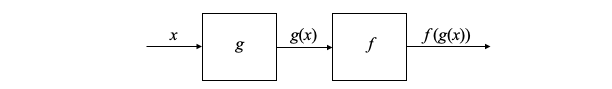

### Advanced Machine Learning 2 | Basics of PyTorch and Backpropagation


#### 1. Basics For PyTorch

**(1) History of PyTorch**

PyTorch began as an internship project by Adam Paszke, which is a part of the Torch library. Torch is an open-source machine learning library, a scientific computing framework, and a script language based on the Lua programming language. It had an initial release October 2002.

**(2) Features of PyTorch**

* Big codebase on CPU and GPU
* Large team of professional developers
* Used in thousands of academic papers
* Deployed by Facebook, Uber, Tesla, Microsoft, OpenAI, etc.

#### 2. Mathematics Behind PyTorch

**(1) Central Difference**

Generally, we have two ways for calculating derivatives. In the previous sections (i.e. Introduction to machine learning) we have talked about, we have used a symbolic derivatives which means that we need full symbolic function. Even though this method is accurate, we can hardly calculate the derivatives when the symbolic function is unclear. Therefore, the second approach we have here is called the numerical derivatives. 
$$
f'(x) \approx \frac{f(x + \epsilon) - f(x - \epsilon)}{2\epsilon}
$$
Althought this formula will not give us an accurate value of derivative, it provides flexibility. Here, we can have an example function where we select $\epsilon = 0.0001$, which can be modified case by case.

```python
def central_difference(func, x):
    eps = 0.0001
    return (func(x + eps) - func(x - eps)) / (2 * eps)
```

**(2) Autodifferentiation**

Automatic differentiation (aka. AD or autodiff) a set of techniques to evaluate the derivative of a function specified by a computer program based on the chain rule. There are two different kinds of pass strategy,

* Forward pass: means to compute the arbitrary function
* Backward pass: means to compute the derivatives of the function

Suppose now we would like to run backward pass on one function $f(x) = x^2$, and we have already known that it has derivative $f'(x) = 2x$. Then we can write it in code as,

```python
class square:
    
    def __init__(self, x):
        self.x = x
        return
    
    def forward(self):
        return self.x**2
    
    def backward(self, d_out):
        return 2 * self.x * d_out
```

Note that if we want to calculate the backward pass of $x = 1$ in this one function situation, we should pass `d_out	= 1` as `square(1).backward(1)` .

Now let's consider the two-function backward with one argument. So here is a forward pass of function $g$ and $f$ on $x$ that shows as follows,



```python
# pseudo code
class f:
  def forward(self, x):
    self.x = x
    return f(x)

class g:
  def forward(self, x):
    self.x = x
    return g(x)
  
result = f.forward(g.forward(x))
```

If we use the univariate chain rule, we can have,
$$
f'_x(g(x)) = g'(x) \times f'_{g(x)}(g(x))
$$
Which means we can extend the former class definitions by,

```python
# pseudo code
class f:
  def forward(self, x):
    self.x = x
    return f(x)
  
  def backward(self, d_out):
    return df(self.x) * d_out
  
  def df(self):
    return central_difference(f, self.x)

class g:
  def forward(self, x):
    self.x = x
    return g(x)
  
  def backward(self, d_out):
    return dg(self.x) * d_out
  
  def dg(self):
    return central_difference(f, self.x)
```

So, to cauculate the $f'_x(g(x))$ value, and the `d_out` passed to backward of the first box should be the value returned by the backward of the second box. The 1 at the end is to start off the chain rule process with a value for `d_out`.


Now, let's see an example. Suppose we want to calculate the derivate of $f(g(x)) = sin(x^2)$ at $x = 3$. Based on chain rule, we can derive that,
$$
f'_x(g(x)) = g'(x) \times f'_{g(x)}(g(x)) = 2 \times x \times cos(x^2) \approx -5.4668
$$
As we have defined `square` class, now we have to define the `sine` class. Note that we use symbolic derivatives for $g(x) = x^2$ and numerical derivatives for $f(x) = sin(x)$ in order to show both of these methods. So now these classes should be defined as,

```python
class square:
    
    def __init__(self, x):
        self.x = x
        return
    
    def forward(self):
        return self.x**2
    
    def backward(self, d_out):
        return self.dsquare() * d_out
    
    def dsquare(self):
        return 2 * self.x

class sine:
    
    def __init__(self, x):
        self.x = x
        return
    
    def forward(self):
        return np.sin(self.x)
    
    def backward(self, d_out):
        return self.dsine() * d_out
      
    def dsine(self):
      	return central_difference(np.sin, self.x)
```

Then we can have the forward pass as,

```
print(sine(square(3).forward()).forward())
```

And the output should be `0.4121`.

Also, the backward pass is calculated as,

```
print(square(3).backward(sine(square(3).forward()).backward(1)))
```

This result of  `-5.4668` matches the value we have calculated by chain rule.

**(3) Backpropagation**

The backward function tells us how to compute the derivastive of one operation, and the chain rule tells us how to compute the derivative of two sequential operations. For backpropagation (aka. Backprop), it is going to show us how to use these rules to compute a derivative for an arbitrary series of operations.

Now, let's suppose we have two arguments $x$ and $y$ and a function $h(x, y)$ defined as follows,
$$
h(x, y) = log(xy) + exp(xy)
$$
Let's suppose we would like to compute the derivatives of $h'_x(x, y)$ and $h'_y(x, y)$. Then based on the $h(x, y)$ function we have defined, we can construct a box graph as follows,


Based on the chain rule, we have,
$$
h'_x(x, y) = log'_x(xy) \cdot y + exp'_x(xy) \cdot y = \frac{1}{x} + ye^{xy}\\
h'_y(x, y) = log'_y(xy) \cdot x + exp'_y(xy) \cdot x = \frac{1}{y} + xe^{xy}
$$
Then let's consider the backpropagation. From right to left, we have `d_out = 1` as an initial backward input. According to the derivatives of $a + b$ on $a$ and $b$ are both 1, the first step backward pass got 1s for as the `d_out` input for the next step.


Then, let's suppose we first compute the backward of the $log$ function. From the backward method we have discussed, the result of this step should be computed as,
$$
log'_x(\text{last_step_forward}) \times d_{out} = log'_x(z)
$$


So the next issue is that, it sames that we can continue to backward to both the green box and the blue box, but the order of the backward pass really matters. Actually, in this case we have to perform the blue box as the next backward step instead of the green one, but how can the machine know that?

**(4) Topological Sort**

To handle this issue, we will process te nodes in a *topological* order. Firstly, we have to note that our graph is not a random directed graph, it is actually a DAG (aka. Directed Acyclic Graph). Please refer to [this article](https://serenefield.com/Blog/posts/DataPipeline/2021-12-01_Data-Pipeline-2---Airflow-Architecture-and-Directed-Acyclic-Graph-c4cd9949af0e.html) if you can not remember clearly what a DAG is. In this case, the direcionality comes from the backward function and the lack of cycles is a consequence of the choice that every function must create a new variable.
