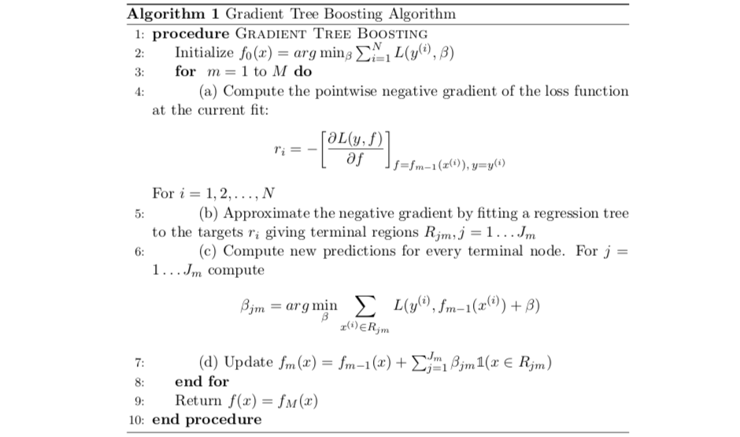

### Advanced Machine Learning 3 | Boosting, AdaBoosting, and Gradient Boosting


#### 1. Adaboosting For Binary Classification

**(1) The Definition of Boosting**

The idea behind boosting is that if we can combone many weak learners, we can become a strong learner as a whole. If we recall bagging, what we want are some models with low bias and high variance, and we take weighted average for reducing the variance. But for boosting, what we want are models with high bias, and we call these models as weak learners.

**(2) Decision Boundary with Tree Classifiers**

Suppose we have a binary classification tree defined as,
$$
\hat{y} = T_m(x) \in \{-1, 1\}
$$
Then the result of of a forest with $M$ trees should be,
$$
\hat{y} = sign(\sum_{m=1}^{M}\alpha_mT_m(x))
$$
Where $\alpha_m$ is the weight of the tree $M=m$.


Because we have,
$$
y \in \{-1, 1\} \\ 
\hat{y} \in \{-1, 1\}
$$
And if $y$ and $\hat{y}$ are correctly classified, we have,
$$
y\cdot \hat{y} > 0
$$
Which is equivalent to,
$$
y\cdot sign(\sum_{m=1}^{M}\alpha_mT_m(x)) > 0
$$
Because the sign won't impact this inequation, then
$$
y\cdot \sum_{m=1}^{M}\alpha_mT_m(x) > 0
$$
If we note the prediction $\sum_{m=1}^{M}\alpha_mT_m(x)$ as a function named $f$, then we can write the inequation above as,
$$
y\cdot f(x) > 0
$$
The left term in the binary classification problem is called the **margin**. Therefore, we can write,
$$
margin > 0 \Leftrightarrow y = \hat{y} \\
margin < 0 \Leftrightarrow y \neq \hat{y}
$$
But there remains one condition, and let's see what happens when we have $margin = 0$. This is equivalent to,
$$
y\cdot f(x) = 0
$$
Because,
$$
y \in \{-1,1\}
$$
we must have,
$$
f(x) = \sum_{m=1}^{M}\alpha_mT_m(x) = 0
$$
In this case, we have equal votes from both sides by M trees, so we can not make a clear classification on which class to predict. Because of that, $f(x) = 0$ is actually defined as the **decision boundary** of the two classes.

**(3) Recall: Log Loss For Binary Classification**

Suppose we have the true value $y \in \{0, 1\}$ and the predicted values as $\hat{y} \in \{-1, 1\}$. Recall we have discussed that the log loss for binary classification defined as,
$$
L(y, \hat{y})=-[(y \log \hat{y}+(1-y) \log (1-\hat{y})]
$$
Note that we assume $\tilde{y} = 1$ predicts the cluster of $y=1$ and $\tilde{y} = -1$ predicts the cluster of $y=0$. Then the equation above can be written as,
$$
L(y, \hat{y})= \begin{cases} -\log \hat{y},   & \tilde{y}=1 \\
                             -\log (1-\hat{y}), & \tilde{y}=-1  \end{cases}
$$
Suppose we take soft prediction of $\hat{y}$ compared with the hard prediction in (1) with $\hat{y} = sign(f(x))$, we have, in this case,
$$
\hat{y} = \text{sigmoid}(f(x))
$$
Which is,
$$
\hat{y} = \frac{1}{1+e^{-f(x)}} = (1+e^{-f(x)})^{-1}
$$
Then we have when $y=1$, 
$$
-\log \hat{y} = -\log (1+e^{-f(x)})^{-1} = \log (1+e^{-f(x)})
$$
And when $y=0$,
$$
-\log (1-\hat{y}) = -\log (1-\frac{1}{1+e^{-f(x)}}) = -\log(1+e^{f(x)})^{-1} = \log(1+e^{f(x)})
$$
Thus, with soft prediction of $\hat{y}$, we have,
$$
L(y, \hat{y})= \begin{cases} \log (1+e^{-f(x)}),  & \tilde{y}=1 \\
                             \log (1+e^{f(x)}), & \tilde{y}=-1  \end{cases}
$$
So this can also be written as,
$$
L(y, \hat{y}) = \log (1+e^{-\tilde{y}f(x)}) \Leftrightarrow L(y, \hat{y}) = \log (1+e^{-yf(x)})
$$
Where $y \in \{-1,1\}$.

If we use the term $\text{margin} = yf(x)$ for this loss function, we can have,
$$
L(y, \hat{y})=\log {(1 + e^{-margin})}
$$
**(4) Exponential Loss and Hinge Loss**

Here, we are going to introduce two more loss functions. The exponential loss function is defined as,
$$
L(y, \hat{y})= e^{-yf(x)}= e^{-margin}
$$
And thee Hinge loss is defined as,
$$
L(y, \hat{y})= \max{(0, 1-yf(x))} = \max{(0, 1-margin)}
$$
If we plot these three loss functions (i.e. log loss, exponential loss, and hinge loss) together, we can have,

```python
import matplotlib.pyplot as plt
import numpy as np

x = np.linspace(-2,5,100)

y1 = np.log(1 + np.exp(-x))
y2 = np.exp(-x)
y3 = np.maximum(0, 1-x)

fig, ax = plt.subplots(1,1,figsize=(10,5))
ax.plot(x, y1, label="logloss")
ax.plot(x, y2, label="exponential")
ax.plot(x, y3, label="hinge")
ax.axhline(0, c='r', ls="--", alpha=.5)

plt.legend()
plt.show()
```


From this plot, we can know that the loss function penalize much on the negative margins but less on the positive margins. 

**(5) Loss Function for AdaBoosting**

AdaBoosting is using exponential loss function as defined because it classify $y=\{-1,1\}$ instead of $y=\{0,1\}$. And because exponential loss penalizes much more than the other loss functions, AdaBoosting is less robust to outliers.

For AdaBoosting, we have the overall loss function is,
$$
Loss = \frac{1}{N}\sum_{i=1}^{N}L(y^{(i)}, \hat{y}^{(i)})= \frac{1}{N}\sum_{i=1}^{N}e^{-y^{(i)}f(x^{(i)})}
$$
Assume our AdaBoosting model is an additive model as follows,
$$
f(x) = \sum_{m=1}^{M}\beta_mT_m(x)
$$
Where $\beta$ is the weight for each tree as our parameters. So we have the loss function as,
$$
Loss = \frac{1}{N}\sum_{i=1}^{N}e^{-y^{(i)}\sum_{m=1}^{M}\beta_mT_m(x^{(i)})}
$$
Or we can write the expression above in a vectorized way,
$$
Loss = \frac{1}{N}\sum_{i=1}^{N}e^{-y^{(i)} \vec{\beta} \cdot \vec{T}(x^{(i)})}
$$
Using the indicator function $\mathbb{1}$ , we can write the expression above as,
$$
Loss = \frac{1}{N} (\sum_{i=1}^{N}e^{- \vec{\beta} \cdot \vec{\mathbb{1}}_{yf>0}} + \sum_{i=1}^{N}e^{\vec{\beta} \cdot \vec{\mathbb{1}}_{yf<0}})
$$
In order to optimize this AdaBoosting model, we have to minimize this loss function for trees and their weights,
$$
\vec{\beta},\vec{T} = \arg \min_{\vec{\beta},\vec{T}}Loss
$$
So for a specific tree $T_m$, suppose the weight of this tree is $\beta_m$, then its loss can be written as,
$$
Loss_m = \frac{1}{N} (\sum_{i=1}^{N}e^{- \beta_m } + \sum_{i=1}^{N}e^{\beta_m })
$$
This is also,
$$
Loss_m = \frac{1}{N} (N_{correct}^{(m)}e^{- \beta_m } + N_{error}^{(m)}e^{\beta_m }) = \frac{N_{correct}^{(m)}}{N} e^{- \beta_m } + \frac{N_{error}^{(m)}}{N}e^{\beta_m }
$$
If we define the error rate $err$ as,
$$
err^{(m)} = \frac{N_{error}^{(m)}}{N}
$$
Then we have,
$$
Loss_m = (1 - err^{(m)})e^{- \beta_m } + err^{(m)} \cdot e^{\beta_m }
$$
To minize the loss for this tree, we have,
$$
\frac{dLoss_m}{d\beta_m} = 0
$$
So,
$$
-(1 - err^{(m)})e^{- \beta_m } + err^{(m)} \cdot e^{\beta_m } = 0
$$
Solve $\beta_m$ and then we can have,
$$
e^{2\beta_m } = \frac{1 - err^{(m)}}{err^{(m)}}
$$
Then,
$$
\beta_m = \frac{1}{2}\log\frac{1 - err^{(m)}}{err^{(m)}}
$$
We can also note $\alpha_m = 2\beta_m$, and this will be useful in the following discussions. So $\alpha_m$ is
$$
\alpha_m =\log\frac{1 - err^{(m)}}{err^{(m)}}
$$
**(6) Training AdaBoosting**

For training the AdaBoosting, let's first denote the weight for each point $i$ as $w_i$, and the weight of each point means how much we care about this point if it is misclassified. Initially, the weights should be set evenly as $\frac{1}{N}$.
$$
w_i^{(0)} = \frac{1}{N}
$$
Then in the iteration $m$, we have the weight of point $i$ updated by the result of tree $T_m$, so,
$$
w_i \leftarrow w_i \cdot e^{-y^{(i)}\beta_mT_m(x^{(i)})}
$$
When $y^{(i)}T_m(x^{(i)}) = 1$, this means we do not misclassify the result, and the expression above should be,
$$
w_i \leftarrow w_i \cdot e^{-\beta_m}
$$
When $y^{(i)}T_m(x^{(i)}) = -1$, this means we do misclassify the result, and the expression above should be,
$$
w_i \leftarrow w_i \cdot e^{\beta_m}
$$
We can rewrite this problem by multiply $e^{-\beta_m}$ to both conditions,
$$
w_i \leftarrow \begin{cases} w_i ,  & y^{(i)}T_m(x^{(i)}) = 1 \\
                             w_i \cdot e^{2\beta_m}, & y^{(i)}T_m(x^{(i)}) = -1  \end{cases}
$$
For the fact that,
$$
\alpha_m = 2\beta_m
$$
We then have,
$$
w_i \leftarrow \begin{cases} w_i ,  & y^{(i)}T_m(x^{(i)}) = 1 \\
                             w_i \cdot e^{\alpha_m}, & y^{(i)}T_m(x^{(i)}) = -1  \end{cases}
$$
Where,
$$
\alpha_m =\log\frac{1 - err^{(m)}}{err^{(m)}}
$$
So the predictions after $M$ iterations should be,
$$
f(x^{(i)}) = \sum_{m=1}^{M}\beta_mT_m(x^{(i)}) = \frac{1}{2}\sum_{m=1}^{M}\alpha_mT_m(x^{(i)})
$$
Since we have a binary classification problem, then the hard predictions are,
$$
F(x^{(i)}) = \text{sign} (f(x^{(i)})) = \text{sign} \sum_{m=1}^{M}\alpha_mT_m(x^{(i)})
$$
Note that $\frac{1}{2}$ can be ignored in this equation.

**(7) Pseudo Code for AdaBoosting**


#### 2. Gradient Boosting

**(1) Idea of Gradient Boosting**

The idea behind gradient boosting is that we adding weak learners $T_m(x)$ for approaching the true value $y$. Suppose we have $M$ weak learners and the prediction after $m$ learners is,
$$
\hat{y}_m = f_m(x^{(i)}) = f_{m-1}(x^{(i)}) + T_m(x^{(i)})
$$
Therefore, we can define the loss function between the prediction $f_m(x^{(i)})$ and the true value $y$ as their difference. We can use MSE, MAE, log loss, or some other loss functions to represent this difference.
$$
Loss = \sum_{i=1}^{N}L(y^{(i)}, f_{m-1}(x^{(i)}) + T_m(x^{(i)}))
$$
Note that this loss fuction is a forward stepwise loss that requires us to define a starting point $f_0$,
$$
f_0 = \alpha
$$
Where $\alpha$ is some constant we select for this optimization.

In order to reach the optimized model, we have to minimize the loss function by steps. So in step 0, we have to solve,
$$
\alpha = \arg\min_{\alpha} \sum_{i=1}^{N}L(y^{(i)}, \alpha)
$$
And then in each step, we have to find a model $T_m$ that minimize the loss function,
$$
T_m = \arg\min_{T_m} \sum_{i=1}^{N}L(y^{(i)}, f_{m-1}(x^{(i)}) + T_m(x^{(i)}))
$$
So the idea of gradient boosting is quite similar to gradient descent because we have,
$$
f_{m}(x^{(i)}) \leftarrow f_{m-1}(x^{(i)}) - \eta \nabla
$$
Note that because we don't know the gradient here, we have to use a model to fit the difference between two iterations, and this difference is called the pseudo residual, which is defined as,
$$
r_{im} = \frac {f_{m}(x^{(i)}) - f_{m-1}(x^{(i)})}{\eta} = -\nabla
$$
Which is also,
$$
r_{im} = -\left.\frac{\partial L}{\partial f}\right|_{f=f_{m-1}\left(x^{(i)}\right),\ y(i)}
$$
**(2) Best Initial Constant**

We have discussed that our model must start with a constant $\alpha$ that minimize the loss function in step 0. So the best initial constant is selected based on the loss function.

* For MSE: we select $\alpha = \bar{y}$
* For MAE: we select $\alpha = \text{Median}(y)$

We can easily prove why these two constants are the best for MSE and MAE. But for the log loss, it can be tricky for calculating the best initial constant. Let's suppose we have a loss function,
$$
L(y, f(x)) = \log (1+e^{-yf(x)})
$$
So the best constant $\alpha$ should be found by,
$$
\alpha = \arg\min_{\alpha} \sum_{i=1}^{N}\log (1+e^{-y^{(i)}\alpha})
$$
 Then,
$$
\frac{d\sum_{i=1}^{N}\log (1+e^{-y^{(i)}\alpha})}{d\alpha} = -\sum_{i=1}^{N} \frac{1}{1+e^{-y^{(i)} \alpha}} y^{(i)} e^{-y^{(i)} \alpha}=0
$$
So,
$$
\sum_{i=1}^{N} \frac{y^{(i)}}{1+e^{y^{(i)} \alpha}}=0
$$
Because $y^{(i)} \in \{1, -1\}$, and we can define $N^+$ as the number of $y^{(i)}= 1$ and $N^-$ as the number of $y^{(i)}= -1$. So we have, 
$$
N = N^+ + N^-
$$
Therefore,
$$
\sum_{i=1}^{N} \frac{y^{(i)}}{1+e^{y^{(i)} \alpha}} =  \frac{N^+}{1+e^{ \alpha}} - \frac{N^-}{1+e^{ -\alpha}}=0
$$
So,
$$
\frac{N^+}{1+e^{ \alpha}} = \frac{N^-}{1+e^{ -\alpha}}
$$
Then,
$$
\frac{N^+}{1+e^{ \alpha}} = \frac{N^-e^{ \alpha}}{1+e^{ \alpha}}
$$
So,
$$
N^+ = N^-e^{ \alpha}
$$
And,
$$
\alpha = \log \frac{N^+}{N^-}
$$
Note that we have,
$$
\frac{1+\bar{y}}{1-\bar{y}}=\frac{1+\frac{N^{+}-N^{-}}{N}}{1-\frac{N^{+}-N^{-}}{N}}=\frac{N+N^{+}-N^{-}}{N-N^{+}+N^{-}} =\frac{N^+}{N^-}
$$
So $\alpha$ is also,
$$
\alpha = \log \frac{1+\bar{y}}{1-\bar{y}}
$$
**(3) General Tree Gradient Boosting**

As we have already defined the pseudo residual is,
$$
r_{im} = -\left.\frac{\partial L}{\partial f}\right|_{f=f_{m-1}\left(x^{(i)}\right),\ y(i)}
$$
Within each iteration, we can fit a regression tree model with $x_i$ to $r_i$,
$$
T_m(x_i) \sim r_i
$$
And then we can derive several terminal regions $R_{jm}$ from this tree $T_m$. Then for each $x_i \in R_{jm}$, make new predictions by minizing the loss fuction,
$$
\beta_{j m}=\arg \min _{\beta} \sum_{x^{(i)} \in R_{j m}} L\left(y^{(i)}, f_{m-1}\left(x^{(i)}\right)+\beta\right)
$$
And then we should update $f_m$ with the new predictions,
$$
f_{m}(x)=f_{m-1}(x)+\sum_{j=1}^{J_{m}} \beta_{j m} \mathbb{1}\left(x \in R_{j m}\right)
$$
**(4) Pseudo Residual For Logloss**

Since we have the definition of pseudo residual as,
$$
r_{im} = -\left.\frac{\partial L}{\partial f}\right|_{f=f_{m-1}\left(x^{(i)}\right),\ y^{(i)}}
$$
And the logloss is defined by,
$$
L(y, f)=\log {(1 + e^{-yf})}
$$
Then,
$$
r_{im} = -\left.\frac{\partial \log {(1 + e^{-yf})}}{\partial f}\right|_{f=f_{m-1}\left(x^{(i)}\right),\ y^{(i)}}
$$
This is also,
$$
r_{im} = -\left.\frac{-y \cdot e^{-yf}}{\log {(1 + e^{-yf})}}\right|_{f=f_{m-1}\left(x^{(i)}\right),\ y^{(i)}}
$$
So,
$$
r_{im} = -\left.\frac{-y}{\log {(1 + e^{yf})}}\right|_{f=f_{m-1}\left(x^{(i)}\right),\ y^{(i)}} = \frac{y^{(i)}}{\log {(1 + e^{y^{(i)}f_{m-1}(x^{(i)})})}}
$$
**(5) Pseudo Residual For MSE and MAE**

For MSE, the pseudo residual is quite simple with,
$$
MSE = (y-f)^2
$$
Then,
$$
r_{im} = -\left.\frac{\partial (y-f)^2}{\partial f}\right|_{f=f_{m-1}\left(x^{(i)}\right),\ y^{(i)}} = -2(y^{(i)}-f_{m-1}(x^{(i)}))
$$
For MAE, the loss function is,
$$
MAE = |y - f|
$$
Then,
$$
r_{im} = -\left.\frac{\partial |y - f|}{\partial f}\right|_{f=f_{m-1}\left(x^{(i)}\right),\ y^{(i)}}
$$
This is to say we have,
$$
r_{im} =  \begin{cases} -\left.\frac{\partial (y - f)}{\partial f}\right|_{f=f_{m-1}\left(x^{(i)}\right),\ y^{(i)}} ,  & y-f\geq0 \\
                             -\left.\frac{\partial (f-y)}{\partial f}\right|_{f=f_{m-1}\left(x^{(i)}\right),\ y^{(i)}}, & y-f<0  \end{cases}
$$
Then,
$$
r_{im} =  \begin{cases} 1  ,  & y-f\geq0 \\
                        -1 , & y-f<0  \end{cases}
$$
So that we can conclude that, for MAE, the pseudo result can be written as,
$$
r_{im} = sign(y^{(i)}-f_{m-1}(x^{(i)}))
$$
**(6) Pseudo Residual for Exponential Loss**

We can continue to derive the pseudo residual for exponential loss. The loss function is defined as,
$$
L(y, f)=e^{-yf}
$$
So for the definition of pseudo residual,
$$
r_{im} = -\left.\frac{\partial e^{-yf}}{\partial f}\right|_{f=f_{m-1}\left(x^{(i)}\right),\ y^{(i)}} = y^{(i)} \cdot e^{-y^{(i)}f_{m-1}\left(x^{(i)}\right)}
$$
**(7) Pseudo Residual for Hinge Loss**

The last pseudo residual we are going to have a look at is with the hinge loss. Suppose the loss function is,
$$
L(y, f)= \max{(0, 1-yf)}
$$
It can also be written as,
$$
L(y, f)= \begin{cases}
					0, & yf \geq 1\\
					1-yf, & yf < 1
					\end{cases}
$$
Then the gradient of $L$ to $f$ is,
$$
r_{im} = \begin{cases}
					0, & yf \geq 1\\
					-\left.\frac{\partial (1-yf)}{\partial f}\right|_{f=f_{m-1}\left(x^{(i)}\right),\ y^{(i)}}, & yf < 1
					\end{cases}
$$
So we have,
$$
r_{im} = \begin{cases}
					0, & yf \geq 1\\
					y^{(i)}, & yf < 1
					\end{cases}
$$
**(8) Best Constant Per Region for Logloss**

After getting the pseudo residual and fitting the model , then, the next step is to find the optimal constant per region. For logloss, that is,
$$
\begin{aligned}
\beta_{j} &=\arg \min _{\beta} \sum_{x^{(i)} \in R_{j}} L\left(y^{(i)}, f_{m-1}\left(x^{(i)}\right)+\beta\right) \\
&=\arg \min _{\beta} \sum_{x^{(i)} \in R_{j}} \log \left(1+e^{-y^{(i)}\left[f_{m-1}\left(x^{(i)}\right)+\beta\right]}\right)
\end{aligned}
$$
Then the derivative is,
$$
G(\beta) = \frac {\partial \sum_{x^{(i)} \in R_{j}} \log \left(1+e^{-y^{(i)}\left[f_{m-1}\left(x^{(i)}\right)+\beta\right]}\right)}{\partial \beta} = -\sum_{x^{(i)} \in R_{j}} \frac{y^{(i)}}{1+e^{y^{(i)}\left[f_{m-1}\left(x^{(i)}\right)+\beta\right]}}
$$
Because $G(\beta)=0$ doesn't have a closed form solution, we will use the following rule for estimating $\beta$
$$
\beta = -\frac{G(0)}{G'(0)}
$$
So, firstly, $G'(\beta)$ is ,
$$
G^{\prime}(\beta)=\sum_{x^{(i)} \in R_{j}} \frac{\left(y^{(i)}\right)^{2} e^{y^{(i)}\left[f_{m-1}\left(x^{(i)}\right)+\beta\right]}}{(1+e^{\left.y^{(i)}\left[f_{m-1}(x^{(i)}\right)+\beta\right]})^{2}}
$$
Note that,
$$
-G(0)=\sum_{x^{(i)} \in R_{j}} \frac{y^{(i)}}{1+e^{y^{(i)}\left[f_{m-1}\left(x^{(i)}\right)\right]}}=\sum_{x^{(i)} \in R_{j}} r_{i}
$$
And,
$$
\left|r_{i}\right|=\frac{1}{1+e^{y^{(i)} \cdot f_{m-1}\left(x^{(i)}\right)}}
$$
So,
$$
1-\left|r_{i}\right|=\frac{e^{y^{(i)} \cdot f_{m-1}\left(x^{(i)}\right)}}{1+e^{y^{(i)} \cdot f_{m-1}\left(x^{(i)}\right)}}
$$
Therefore, 
$$
\beta_{j}=\frac{\sum_{x^{(i)} \in R_{j}} r_{i}}{\sum_{x^{(i)} \in R_{j}}\left|r_{i}\right|\left(1-\left|r_{i}\right|\right)}
$$
**(9) General Pseudo Code for Gradient Tree Boosting** 



**(10) Pseudo Code for Gradient Tree Boosting with MAE Loss**


**(11) Pseudo Code for Gradient Tree Boosting with MSE Loss**


